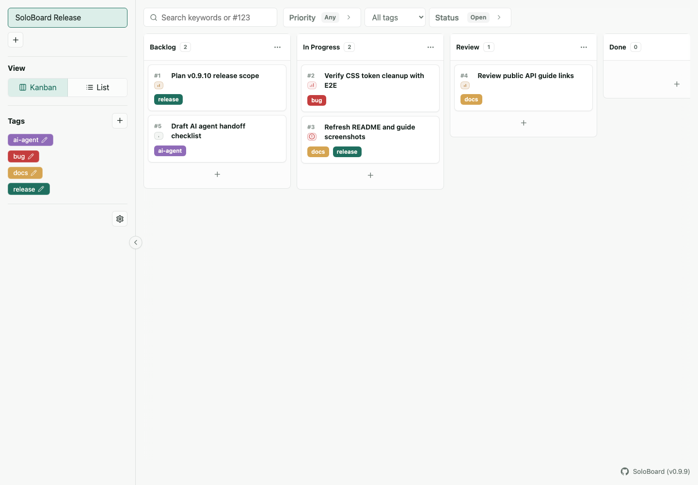

# Kanbalone

[English](README.md)

<p align="center">
  
</p>

Kanbalone は、個人が AI とともに開発するために最適化した小さなローカル Kanban アプリです。

Remote issue を、AI と実装するためのローカル作業面に変えます。

Dockerでサクッと起動してすぐ使えます。
ブラウザで人間が使える Web UI に加えて、スクリプトや AI エージェントから利用しやすい JSON API も備えています。

GitHub Issues、GitLab、Redmine などの remote issue をローカルに取り込み、Kanbalone 上で local body と comment を育てながら実装を進められます。remote は正本のまま、Kanbalone は個人開発者と AI のための execution workspace として使えます。





## Kanbalone の特徴

- AI と共に 1 人で 1台のマシンで使うことに最適化し、ユーザ管理や権限管理は排除
- データは全てローカルで保存
- GitHub Issues、GitLab、Redmine などの remote issue を取り込み、ローカルの実装ワークスペースとして扱える
- 作業カテゴリごとの複数ボード管理
- タグ、コメント、チケット間の依存関係（ブロッカー、親子チケット）管理
- remote の title / body を参照しつつ、Kanbalone 側で実装本文を厚く育てられる
- comment だけを remote に返すシンプルな連携で、作業ログを扱いやすい
- 自動化や AI エージェントからも扱いやすい軽量 JSON API
- 起動して最初のボードを作成したら、面倒な設定なしですぐタスク管理開始

## Quick Start

公開済み Docker Image で起動します。

```bash
docker run --rm \
  -p 3000:3000 \
  -v kanbalone-data:/app/data \
  ghcr.io/wamukat/kanbalone:v0.9.27
```

ブラウザで開きます。

```text
http://127.0.0.1:3000
```

ユーザーガイド:

```text
https://wamukat.github.io/kanbalone/
```

固定バージョンではなく、最新リリースの Image を使いたい場合は `ghcr.io/wamukat/kanbalone:latest` を指定してください。

## Docker Compose

公開済み Image を Compose で起動します。

```bash
docker compose -f docker-compose.image.yml up
```

ホスト側のポートを変更する場合:

```bash
KANBAN_PORT=3457 docker compose -f docker-compose.image.yml up
```

アプリは SQLite データベースを以下に保存します。

```text
/app/data/kanbalone.sqlite
```

同梱の Compose ファイルでは、永続化のために `kanbalone-data` という Docker named volume を使います。

Windows では、Docker Desktop または Rancher Desktop with WSL2 を使い、named volume の構成を維持してください。


## Local Development

```bash
pnpm install
pnpm dev
```

デフォルト URL:

```text
http://127.0.0.1:3000
```

GitLab / Redmine 用 remote provider sandbox:

```bash
docker compose -f docker-compose.remote-providers.yml up -d
pnpm sandbox:remote-providers
```

Kanbalone は remote provider credential が 1 つ以上設定されている場合だけ、remote issue import の導線を表示します。import panel には設定済み provider だけが表示されます。

詳細は [Remote provider sandbox](docs/ja/developer/remote-provider-sandbox.md) を参照してください。

## Codex Skill

Kanbalone には、API だけで Kanban を操作するための Codex skill を同梱しています。

```bash
mkdir -p "${CODEX_HOME:-$HOME/.codex}/skills"
cp -R skills/kanbalone-api "${CODEX_HOME:-$HOME/.codex}/skills/"
```

Docker image だけを使う場合は、GitHub release tag から skill を取得して Codex が動くホスト側へコピーします。

```bash
tmpdir=$(mktemp -d)
curl -L https://github.com/wamukat/kanbalone/archive/refs/tags/v0.9.27.tar.gz \
  | tar -xz -C "$tmpdir" kanbalone-0.9.24/skills/kanbalone-api
mkdir -p "${CODEX_HOME:-$HOME/.codex}/skills"
cp -R "$tmpdir"/kanbalone-0.9.24/skills/kanbalone-api "${CODEX_HOME:-$HOME/.codex}/skills/"
rm -rf "$tmpdir"
```

skill はホスト側で実行され、`http://127.0.0.1:3000` などの Kanbalone HTTP API に接続します。

## Documentation

公開ユーザーガイド:

- <https://wamukat.github.io/kanbalone/>

利用者・API クライアント向け:

- [ユーザーガイド](docs/ja/user-guide.md)
- [データモデルと概念](docs/ja/concepts.md)
- [AI API ガイド](docs/ja/ai-api-guide.md)
- [API 例](docs/ja/api-examples.md)
- [OpenAPI](docs/openapi.yaml)

開発者・メンテナ向け:

- [開発ガイド](docs/ja/developer/development.md)
- [Remote provider sandbox](docs/ja/developer/remote-provider-sandbox.md)
- [Docker Image 配布](docs/ja/developer/docker-image-distribution.md)
- [リリース手順](docs/ja/developer/release.md)
- [パフォーマンスツール](docs/ja/developer/performance.md)
- [ダイアログボタンポリシー](docs/ja/developer/dialog-button-policy.md)
- [デザインシステム](docs/ja/developer/design-system.md)

## Tech Stack

- Node.js 22
- Fastify
- SQLite via `better-sqlite3`
- TypeScript
- Vanilla HTML/CSS/JavaScript
- Lucide-style SVG icons

## License

[MIT](LICENSE)
