# Kanbalone User Guide

Kanbalone is a lightweight kanban tool for personal work, small release planning, and collaboration with AI agents.

This guide follows the order a new user can use to start working.

## Quick Demo

This short demo shows ticket creation with Markdown, creating and attaching a tag, drag and drop, search, filters, comments, and List view.

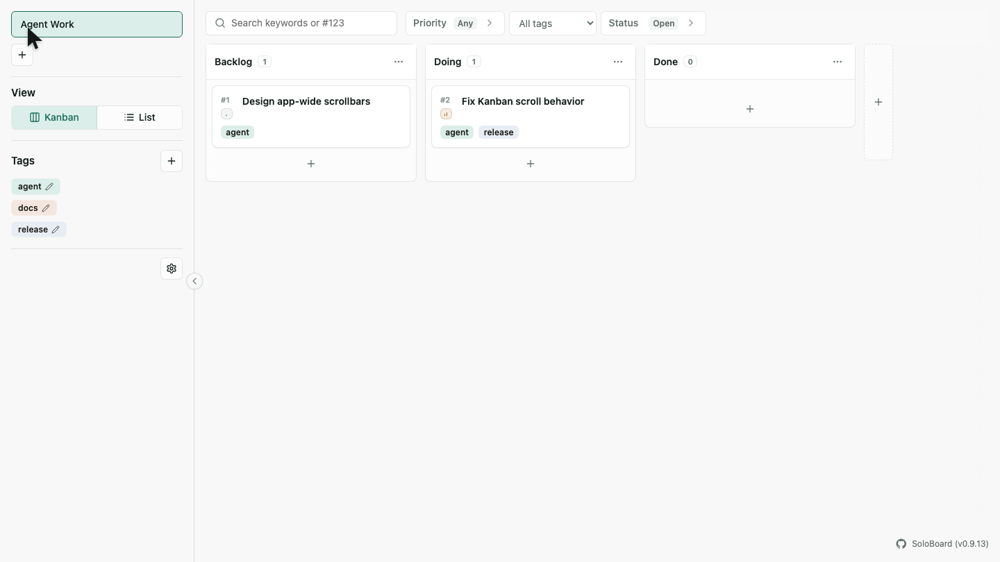

## 1. Create Your First Board

Click the `+` in the upper-left sidebar to show the board name input.

Type a board name and press Enter to create your first board.

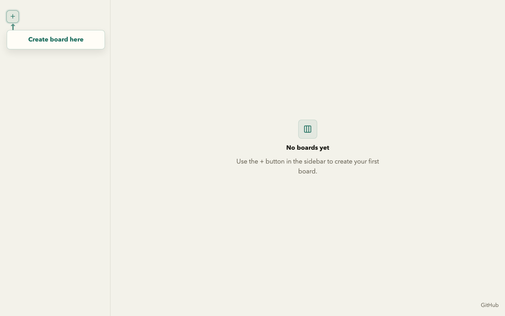

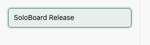

## 2. Learn The Workspace

After creating a board, the workspace appears.

Choose a board in the left sidebar and move tickets in the central Kanban area. Use `Kanban` / `List` in the sidebar to switch views.

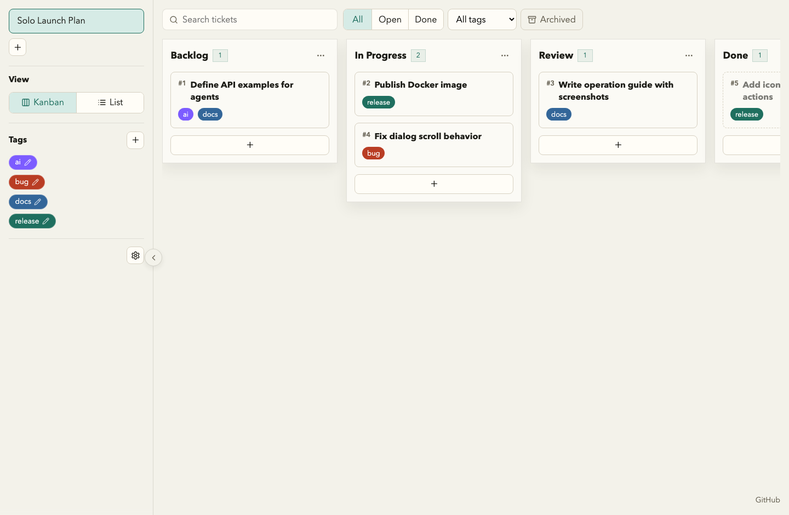

## 3. Set Up Lanes

Use the `+` at the bottom of the board to add a lane. Type the lane name and press Enter.

Rename and delete actions are available from each lane's action button.

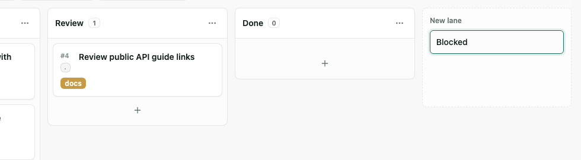

## 4. Create A Ticket

Use the `+` in a lane to create a ticket.

Enter a title and body. You can also set Lane / Priority, Tags, and Relations.

Main fields:

- Title
- Body written in Markdown
- Lane / Priority
- Tags
- Relations

Relations let you set blockers and a parent ticket.

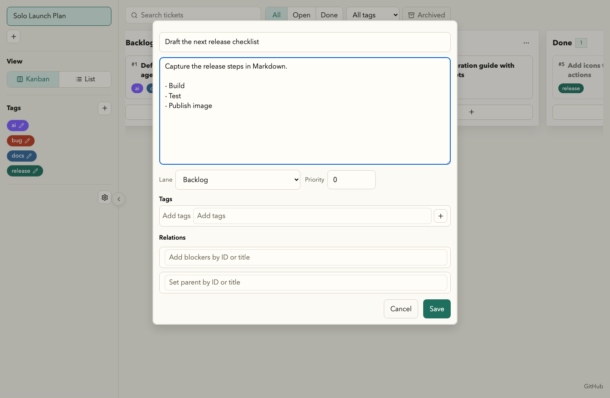

## 5. Read A Ticket

Click a ticket to open its detail view.

The detail view shows the body, relationships, comments, and activity.

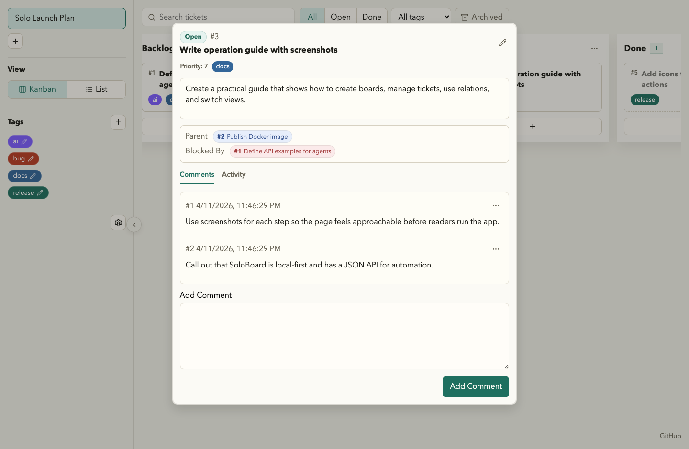

## 6. Edit A Ticket

Use the pencil icon in the upper-right of the detail view.

You can change Lane / Priority / Resolved, Tags, Relations, and the body.

For a remote tracked ticket, the title becomes a remote-owned read-only value. The editable implementation text lives in `Local Body`.

Relations let you edit blockers, parent tickets, and child tickets.

Use `Move` in the detail view to move a ticket to another board and lane. Matching tag names are kept. Parent, child, and blocker links are cleared when the ticket moves to another board.

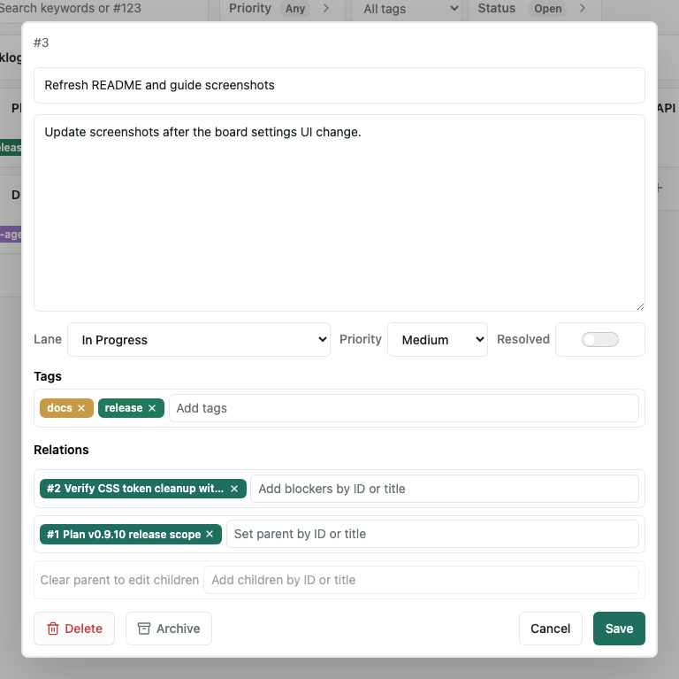

## 7. Use Comments And Activity

You can leave comments in the ticket detail view.

The `Activity` tab shows history such as comment creation, updates, and deletion.

For a remote tracked ticket, comments can also be pushed back to the remote issue. When a push fails, the failure details are visible on that comment.

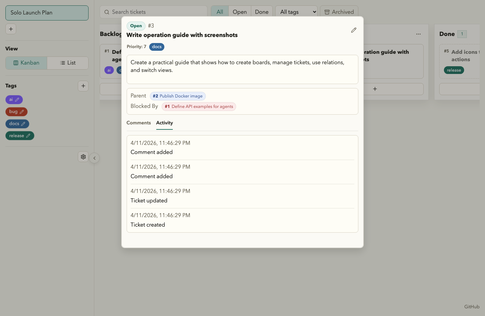

## 8. Work With Remote Issues

Kanbalone can import remote issues from systems such as GitHub Issues, GitLab, and Redmine and treat them as local execution tickets.

The current implementation supports GitHub Issues, GitLab, and Redmine as providers.

- The remote tracker stays the source of truth for the issue.
- Kanbalone becomes the local execution workspace.
- `Local Body` is where you build implementation context for yourself and AI.
- Only selected comments are pushed back to the remote issue.

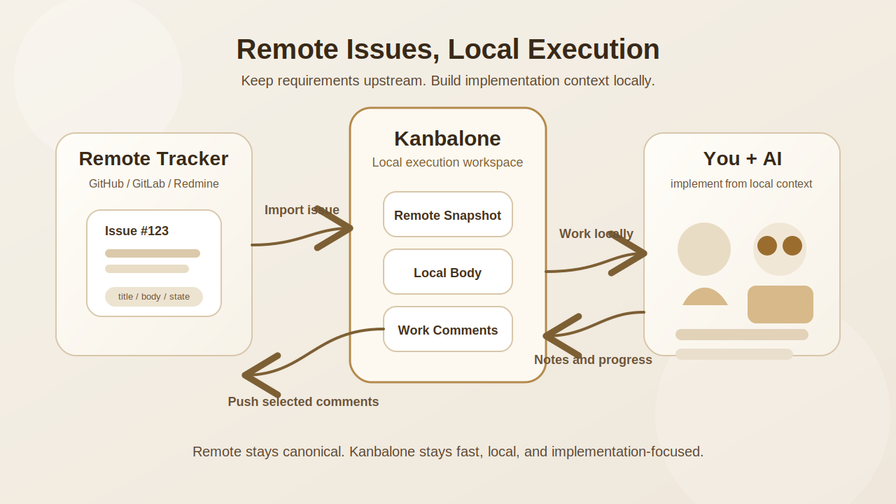

### 8.1 Import A Remote Issue

Use the import icon in the upper-right of the create-ticket dialog. The icon is shown only when at least one remote provider credential is configured.

The panel asks for:

- Provider
- Issue URL
- Destination lane

Only providers with configured credentials are shown in the panel.

Use `KANBALONE_REMOTE_CREDENTIALS` or the local sandbox bootstrap when you want to enable GitLab or Redmine locally.

After import, the remote issue appears as a normal ticket on the board.

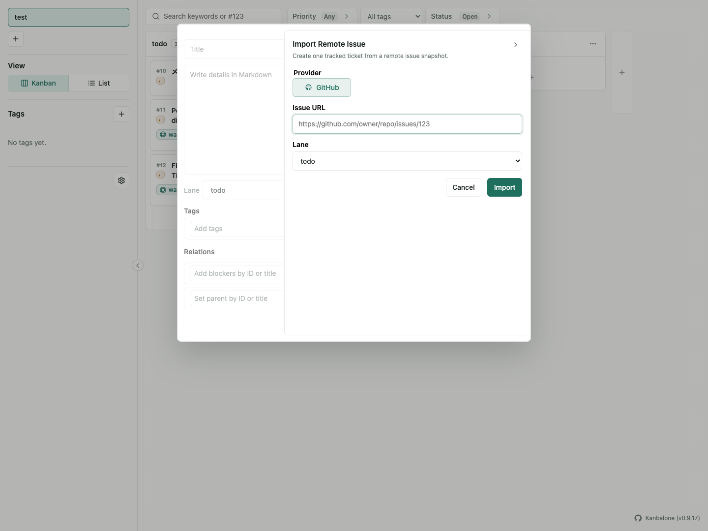

### 8.2 Read A Remote Ticket

Remote tracked tickets show a remote reference in the detail view.

The body is split into `Local Body` and `Remote Body`.

- `Local Body`
  Your implementation notes, execution plan, and AI-facing working text
- `Remote Body`
  A read-only snapshot imported from the remote issue

Use `Refresh` to pull the latest remote title, body, and state.

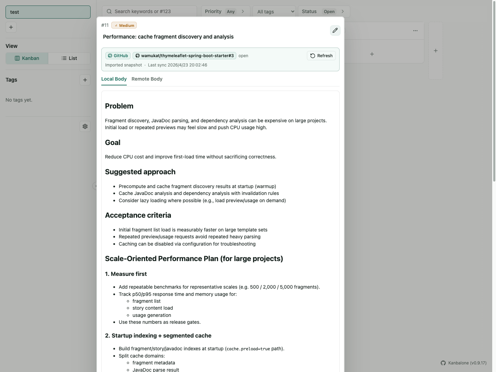

### 8.3 What You Can Edit

Editable:

- Local Body
- Lane / Priority
- Tags / Relations
- Comments

Read-only:

- Title
- Remote Body

If the issue requirements change, edit them in the remote tracker and then refresh the ticket in Kanbalone.

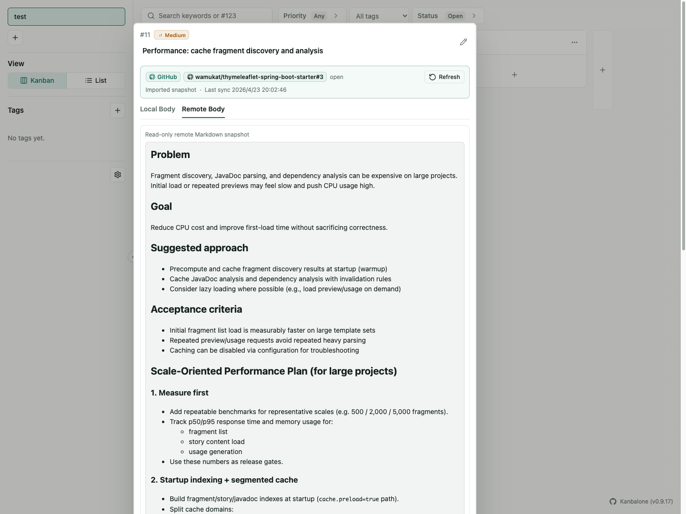

### 8.4 Push Comments Back To Remote

Comments are created locally first.

Push only the comments you want to send upstream with `Push to remote`.

Comment states:

- `Push to remote`
  Still local only
- `Pushed`
  Already posted to the remote issue
- `Push failed`
  Remote post failed; click it to inspect the details


In the MVP, pushed comments cannot be edited or deleted. Add a new comment and push again when you need to correct something.

### 8.5 Refresh Remote Snapshots

`Refresh` updates the remote snapshot fields only.

Updated:

- remote title
- remote body
- remote state

Not updated:

- local body
- local comments
- lane / priority / tags / relations

This keeps the remote issue as the canonical requirement while letting Kanbalone evolve its own local implementation context.

## 9. Resolve And Organize Tickets

You can mark finished work Resolved. You can also move it to a Done lane.

Archive tickets you no longer need to see every day. Archived tickets are hidden from the normal board.

Open `Status >` to the right of the tag filter and add `Archived` when you need to include archived tickets. You can add `Resolved` from the same menu. Use the `x` icon inside the filter to clear that filter.

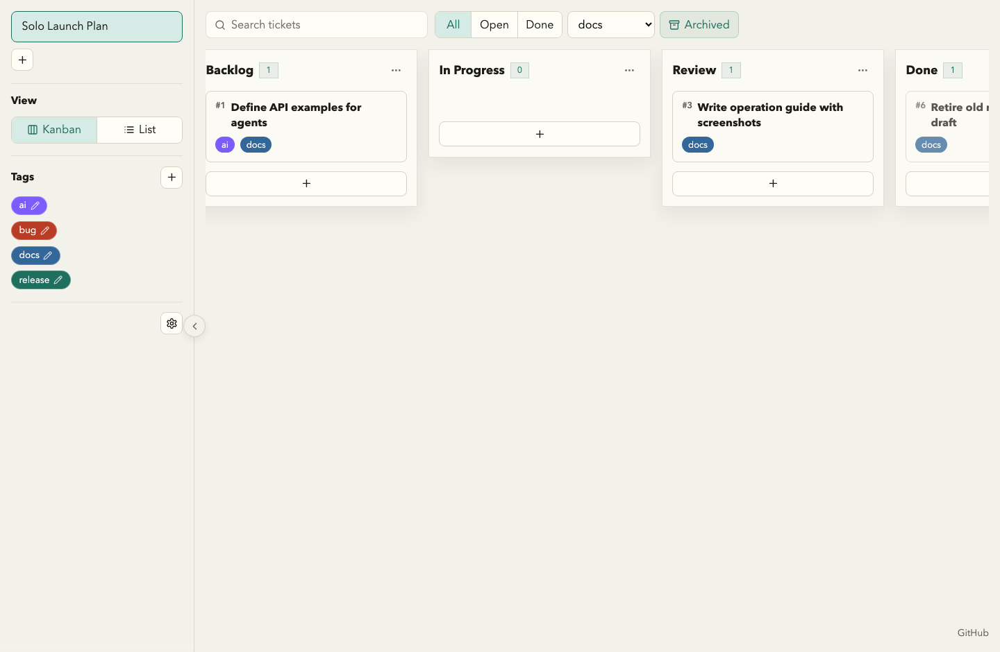

## 10. Find Tickets

The search field can filter by keyword and ticket number.

- Search title and body with a keyword such as `login`.
- Search ticket numbers with `#123` or `123`.

Open `Priority >` in the filter area when you want to filter by priority. You can select multiple values: Low, Medium, High, and Urgent.

When the search field has a value, use the `x` on the right to clear it.

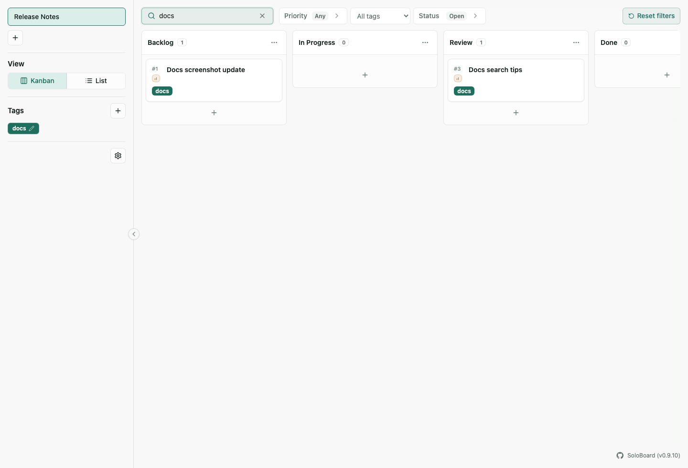

## 11. Classify Work With Tags

Use the tag filter to show only tickets for a specific theme.

Create tags from the `+` in the sidebar Tags section. Click a tag badge later to edit its color.

When editing a ticket, type a new tag name in the Tags field and press `+` to create it as a no-color tag.

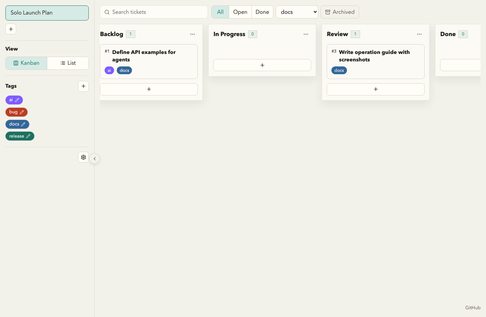

## 12. Review In List View

Switch to `List` in the sidebar to review tickets in a table.

List view shows Resolved / Archived state and priority in columns.

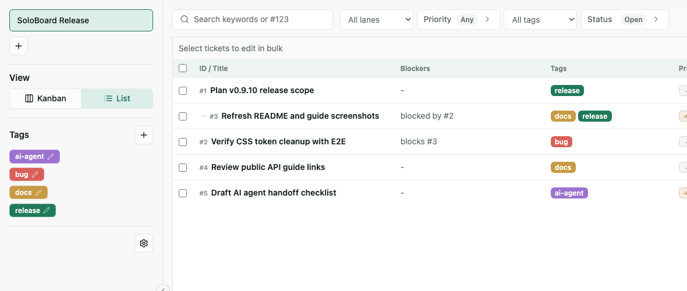

Select tickets in List view to show bulk actions.

You can mark multiple tickets Resolved, reopen them, Archive them, or Restore them.

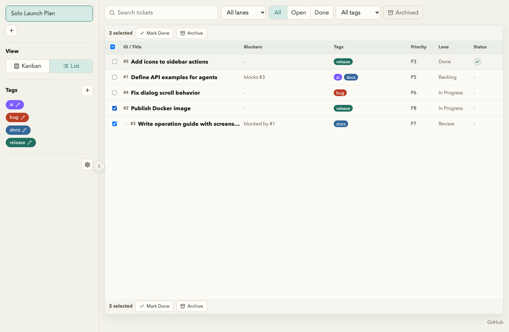

## 13. Use Board Settings

Board rename, Export / Import, and Delete are available from the gear at the bottom of the sidebar.

Open the gear and click the pencil icon next to the board name to edit the name in place. Press Enter to save, or press Esc / move focus away to cancel.

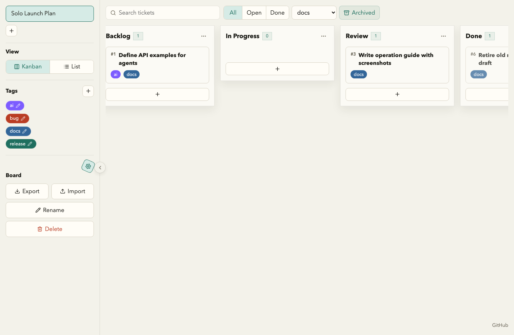

## 14. Dark Mode

Kanbalone does not have an in-app Light / Dark toggle.

It follows the OS or browser color-scheme setting. When your system is in dark mode, Kanbalone uses the dark theme.

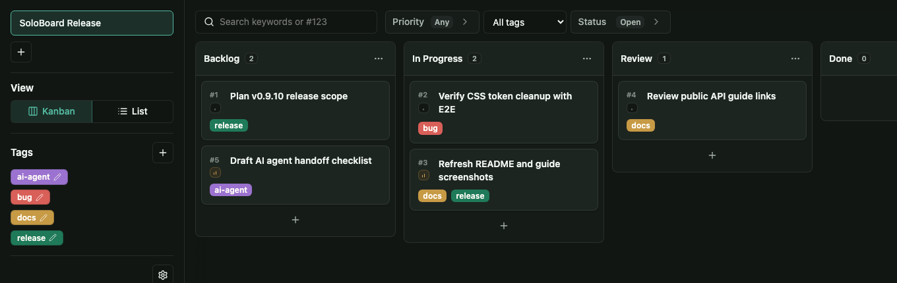

## Try With Docker

```bash
docker run --rm \
  -p 3000:3000 \
  -v kanbalone-data:/app/data \
  ghcr.io/wamukat/kanbalone:v0.9.27
```

Open:

```text
http://127.0.0.1:3000
```

Data is stored at `/app/data/kanbalone.sqlite`. With a Docker named volume, data survives container recreation.

Kanbalone does not include authentication. Do not expose it directly to untrusted networks.
